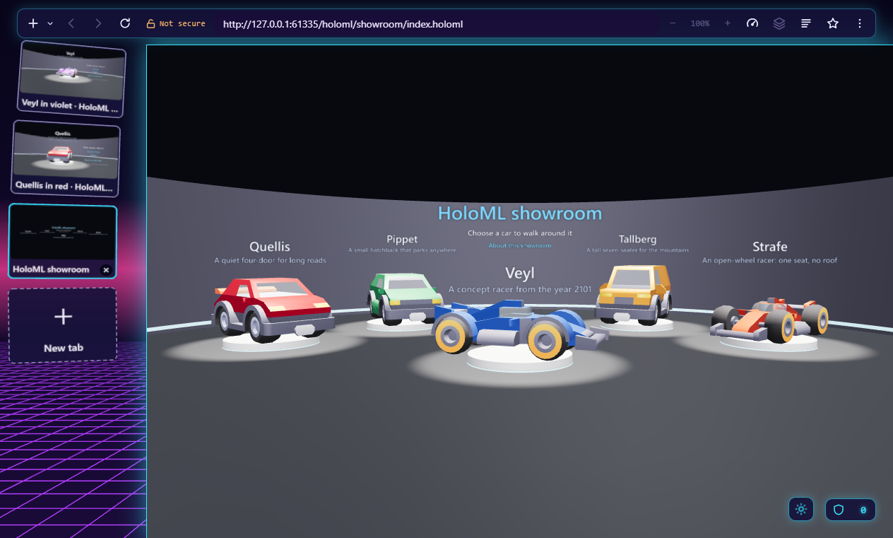
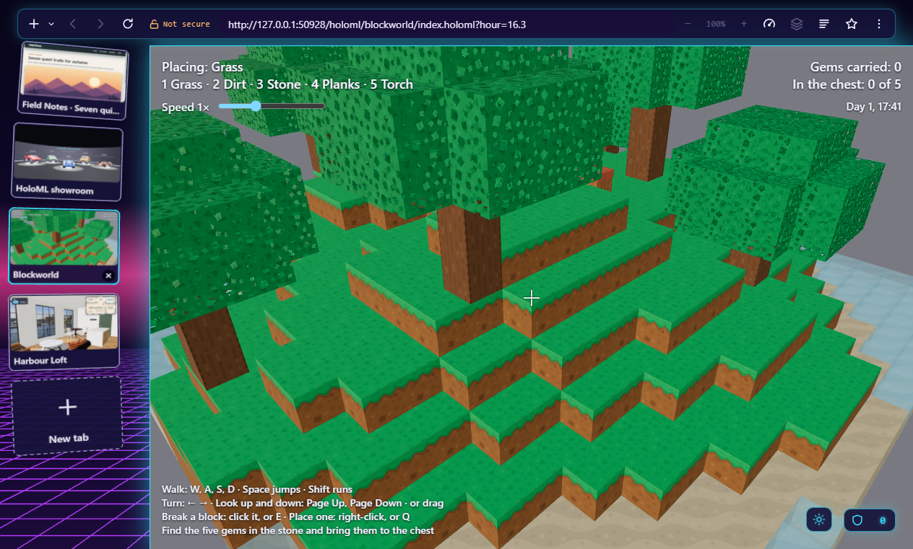
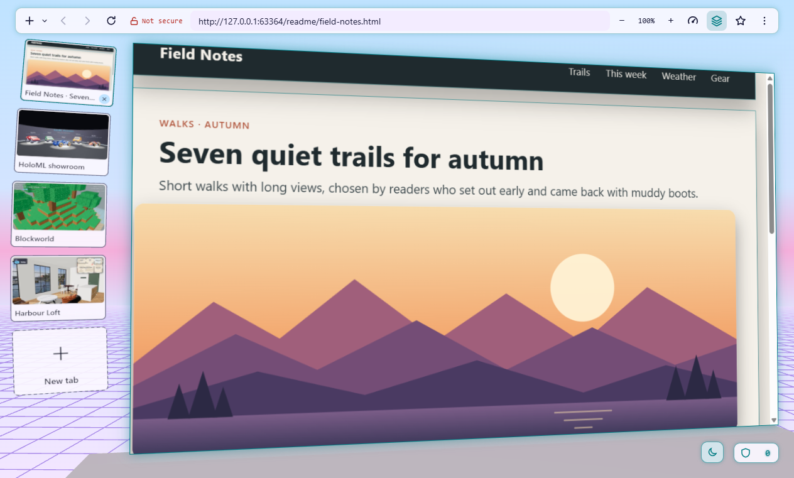
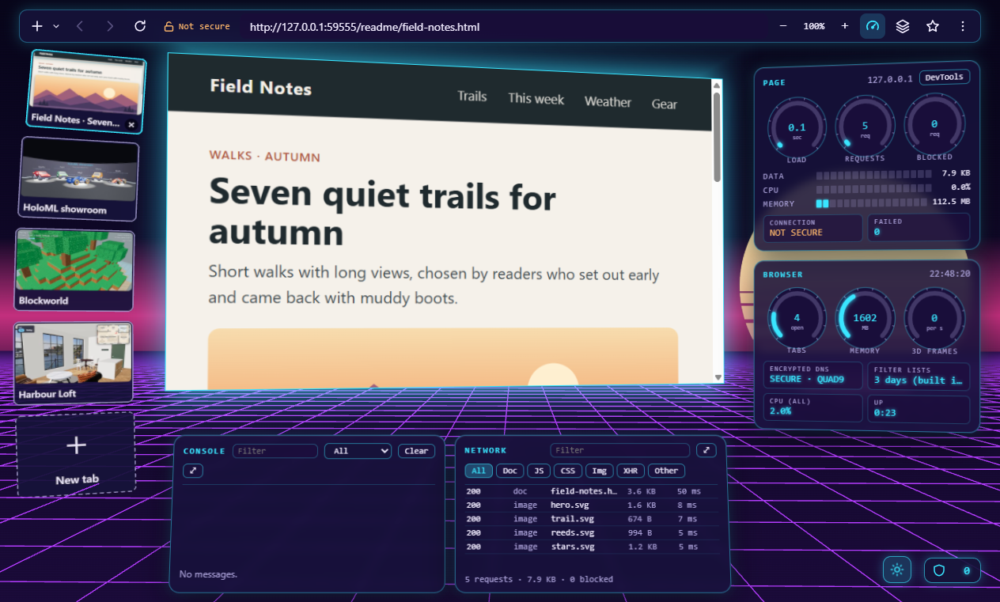

# HyperSol HyperSpace 3D

HyperSpace 3D is an open-source desktop web browser whose interface lives in three
dimensions. It is experimental: a developer preview, not yet for
everyday browsing. Ordinary websites float as panels in a 3D room, page sections
lift into layered depth, and a companion markup language, HoloML, lets
anyone publish a fully 3D website as easily as writing HTML.

<table>
  <tr>
    <td width="50%"></td>
    <td width="50%"></td>
  </tr>
  <tr>
    <td><b>3D websites.</b> <a href="https://github.com/srajpal/holoml/tree/main/examples/harbour-loft">Harbour Loft</a>, written in HoloML: walk through a loft by the harbour, open its doors, switch its lamps on, and go up to the roof terrace.</td>
    <td><b>Games, too.</b> <a href="https://github.com/srajpal/holoml/tree/main/examples/blockworld">Blockworld</a>: walk, break and place blocks, and find five gems, with the mouse or the keyboard alone.</td>
  </tr>
  <tr>
    <td></td>
    <td></td>
  </tr>
  <tr>
    <td><b>Ordinary websites, in depth.</b> Any page on a tilted panel, its sections and pictures lifted into layers; tabs as cards; a dark and a light theme.</td>
    <td><b>An instrument panel.</b> The page's load, requests, and blocked trackers, the browser's own gauges, the console, and the network.</td>
  </tr>
</table>

*The newest build, made with `pnpm screenshots:readme` from local
copies: HoloML's examples (Harbour Loft's furniture, textures, and
harbour from Poly Haven, CC0; Blockworld's blocks from Kenney, CC0) and
a made-up sample page.*

For Windows and Linux (checked by automatic tests on both); macOS is
planned but untested. Apache 2.0. No telemetry.

**Status (2026-09-30): experimental.** Released: the
[0.9.0 developer preview](https://github.com/srajpal/hypersol-hyperspace-3d/releases/tag/v0.9.0),
a pre-release, as source for developers (no installers yet; releases
stay pre-releases until 1.0). Since then, HoloML 0.1 has
been written down in its own repository (milestone 13), and this browser
shows HoloML pages (milestones 14 to 21, accepted; not yet in a
release), with limits for heavy scenes, keyboard and screen-reader
access, a scene inspector, and a HoloML car showroom to try from the
start panel. Milestone 17 adds Blockworld, a small block game written in
the first part of HoloML 0.2 (scripts, sound, walls and gravity), and a
HoloML examples section. Milestone 18 adds walking and turning speeds a
page can set, sliders on the screen (Blockworld's Speed slider), and the
sofa studio, a shop page with shadows, textured fabrics, and choices
that change the sofa in place. Milestone 19 adds text panels, doors and
lamps that work with a click, places to go to, a sky, a floor plan, and
Harbour Loft, a flat by a harbour to tour. Milestone 20 adds groups of
models that load only while you are near them, with lighter stand-ins
until then, and the sneaker store, one shoe in ten colourways to walk
among, turn over, and add to a cart. Milestone 21 adds water, sounds
that come from a place, and the ocean tunnel, an aquarium to walk
through with 30 fish swimming over and around you, and completes HoloML
0.2. Milestone 22 documents HoloML: its specification, guides, and site.
On 2026-09-30 both repositories were reviewed and the findings fixed,
the security ones first ([CHANGELOG.md](CHANGELOG.md), Unreleased),
except those [TODO.md](TODO.md) lists with the reason.
Then HoloML 0.3, privacy and data tools, and more of the 3D room;
installers come last. See [Progress](#progress),
[TODO.md](TODO.md), and [Project documents](#project-documents).

## The story

In December 2000, two computer engineering students who had met at
Florida Atlantic University, Sunny Rajpal and Mauricio Sadicoff, started
a small Florida software company. In early 2001 it became HyperSol, with
a plain mission: build high-quality software that makes people's
time on a computer more productive and more fun.

Their first product was a web browser. HyperSol WebSurfer was born, as
the original site put it, "when we needed some features that no other
browser would allow", starting with control over the pop-up windows that
plagued the web of 2001. Since they were writing a browser anyway, they
kept going. WebSurfer 1.0.0 shipped on March 5, 2001, free, for Windows
95, 98, 2000, and ME. By March 13 it was at version 1.0.6 and updating
itself with a press of Ctrl+U.

Some of what made it different still reads as ahead of its time:

- **Themes** that changed the whole browsing environment, not just the
  colours: new images, new buttons, and matching sounds across the
  application. It shipped with three: Surfer, Space, and Winter.
- **Automatic page refresh** for stock quotes every minute or headlines
  every five seconds.
- **A full HTML editor** built into the browser, with colour-coded source
  and one-click preview.

The site's own pitch was simple: "It's new, it's cool, and it's FREE!"
The company's second product, CheckIfSiteIsStillUp, was named Download
of the Day on TechTV's The Screen Savers in July 2001.

Behind the shipped features sat a bigger idea: a browser where the web
itself is not flat. Sites rendered in three dimensions. A browser you
look into, not at. Between 2001 and 2003 that idea became the concept
for HyperSol's next step after WebSurfer: HyperSpace 3D. An early
concept screen from that work survives, a blue cube tilted toward the
viewer over a loading bar, and is shown below as it was. It was a
concept of its time; there is no claim here that it shipped as a
product.


That was 2001. The hardware, the graphics APIs, and the open web
platform were not ready. Twenty-five years later they are.

## The salute

HyperSol HyperSpace 3D marks the 25th anniversary of HyperSol's
formation by finally building that idea, in the open, for everyone. It keeps the
spirit of the original: free, themed, a little bit cool, and made by
people who wanted a browser that did something no other browser would.

The name comes from that early concept; the spirit comes from
WebSurfer. The mission is the same. The third dimension, this time, is
real. (Until 2026-09-26 this project was called HyperSol WebSurfer 3D.)

HyperSol, the company, no longer exists. HyperSpace 3D is a personal
project that honours it, not a commercial product.

An archived copy of the 2001 site is available through the
[Wayback Machine](https://web.archive.org/web/20010922111629/http://www.hypersol.com/).

## What it does

- Any normal website, live on a tilted page in a 3D room, with tabs as
  cards (or a list in the top bar), an address bar that completes and
  searches, bookmarks, history, and a Library.
- A layers view that lifts a page's sections and pictures to different
  depths.
- Privacy on by default: ad and tracker blocking with a shield, encrypted
  DNS, private tabs, and no telemetry.
- A password manager using the system's keychain, site permissions
  for the camera, microphone, and location, and a prompt for sites and
  proxies that ask for a user name and password in the browser's own
  dialog (HTTP sign-in; what you type goes to Chromium's handling of the
  request only, and is never saved).
- Two themes, Nebula (a synthwave night) and Daylight (a pastel 1990s
  day), an instrument panel with live readouts, zoom, find in page,
  downloads, printing, remappable shortcuts, and an economy mode with
  sleeping tabs.
- HoloML pages: fully 3D sites you orbit or walk around (milestone 14),
  with limits that keep a heavy scene from exhausting memory, Tab and
  screen-reader access to a scene's links and named things, a text view,
  reduced motion, and a Scene part in the instrument panel (milestone 15).
- A HoloML showroom to try, linked from the start panel: five cars in a
  hall, each to walk around in three colours (milestone 16).
- HoloML 0.2 pages (milestone 17): scripts from the page's own site,
  sound after the first click or key, text on the screen, walls and
  gravity for walking, and animated lights; Blockworld, a small block
  game, shows them. A HoloML examples section (Ctrl+Shift+E) lists every
  example with a picture, and links to the HoloML repository.
  Milestone 18: a page sets how fast the viewer walks and turns, and
  can put sliders on the screen for its script (Blockworld's Speed
  slider); shadows, a material's own pictures (fabric, wood), choices
  on the screen that change a material in place, and light from a
  panorama of the surroundings, shown by the sofa studio. Milestone 19:
  text of more than one line on a board in the scene, doors and lamps
  that work with a click (and from the keyboard), places to go to, a
  fade between a site's pages, a sky, and a floor plan, shown by
  Harbour Loft. Milestone 20: groups of models that load only while the
  viewer is near and are let go (their memory released) when the viewer
  walks away, with a lighter stand-in in each model's place until then,
  shown by the sneaker store. Milestone 21: water that things are seen
  through, fading into its colour with distance, with the light from its
  waves moving over what is in it; sounds that come from a place,
  quieter with distance and from their side; and a model's animation
  speed for scripts, shown by the ocean tunnel, an aquarium.
- Mouse and keyboard throughout; touch for scenes.

## Built with the Buildwright approach

Sunny Rajpal developed this project through agentic coding: directing AI
coding agents to implement software while retaining responsibility for
scope, decisions, review, and acceptance. It applies the concepts taught
in [Buildwright](https://buildwrightcourses.com), organized around five
repeatable moves:

| Move | What it means |
| --- | --- |
| **Brief** | Define who the software helps, the problem it solves, and the first useful result. |
| **Architect** | Decide how the parts fit together, including the screens, data, constraints, and boundaries. |
| **Decompose** | Break the work into small tasks, each with a result that can be checked. |
| **Delegate** | Give an AI coding agent a focused task, review its plan, and guide its implementation. |
| **Verify** | Try the result, inspect the evidence, and correct what does not meet the brief. |

In HyperSpace 3D, the [brief](BRIEF.md) turned a broad vision for a 3D web
into a first useful browsing experience. The [architecture](ARCHITECTURE.md)
separated the desktop shell, page rendering, and supporting components,
using Chromium through Electron rather than building a browser engine
from scratch. The [roadmap](TODO.md) divided that work into milestones
with explicit checks. Focused prompts and approvals directed implementation;
automated tests, visual checks, and owner feedback informed corrections.
The [lightly edited owner prompt log](PROMPTS.md) and
[milestone records](docs/progress.md) show that process in practice.

This is a sustained personal project informed by Sunny's software
engineering experience, not a promised beginner-course outcome. Buildwright
starts with a small prototype and the same habits of direction and checking.

## What comes next

Milestone 22, documentation for HoloML to recognised standards (being
built). 23, HoloML 0.3: the features its check found missing, such as
names for models and the language of text. 24, privacy and data tools:
HTTPS-only browsing, per-site storage, and bookmark import and export.
25, free camera movement around the room. 26, pictures and 3D models
lifted out of ordinary pages. 27, polish. Last, 28 and 29, installers as
1.0 for Windows and Linux, then macOS. Later: mobile, and VR. The full
roadmap is in [TODO.md](TODO.md).

## Progress

Twenty-one milestones are done and accepted.
Milestones 1 to 11 built the browser: a live page on a tilted panel in
the 3D room, tabs as cards, bookmarks and history, ad and tracker
blocking with encrypted DNS, the layers view, two themes, an instrument
panel, the everyday tools (zoom, find, downloads, printing, private
tabs), passwords and site permissions, tab tools with an economy mode,
address bar completion, view settings, and remappable shortcuts.
Milestone 12 released it as the 0.9.0 developer preview, with automatic
tests on Windows and Linux. Milestone 13 wrote HoloML 0.1 down in its
own repository, and milestone 14 shows HoloML pages in the browser.
Milestone 15 hardens them: limits for
heavy scenes, keyboard and screen-reader access, a text view, and a
scene inspector. Milestone 16 adds a HoloML car showroom, published with GitHub Pages and linked from the
start panel. Milestone 17 adds Blockworld, a small block game in HoloML
0.2, and the HoloML examples section. Milestone 18 adds walking speeds,
sliders, and the sofa studio, a shop page with shadows, textured
fabrics, and choices that change the sofa in place. Milestone 19 adds
Harbour Loft, a flat to tour, with panels of text, doors and lamps to
click, places, a sky, and a floor plan. Milestone 20 adds loading by
area and the sneaker store. Milestone 21 adds water, sounds from a
place, and the ocean tunnel, an aquarium, and completes HoloML 0.2.
Milestone 22 documents HoloML, with its specification, guides, and site.
See [docs/progress.md](docs/progress.md) for each milestone with
screenshots, and [TODO.md](TODO.md) for the roadmap.

## HoloML

HoloML is the 3D markup language developed alongside the browser, in its
own repository so it stays independent and reusable:
[github.com/srajpal/holoml](https://github.com/srajpal/holoml).
Versions 0.1 and 0.2 are written down there (SPEC.md), with a parser, a
checker, and sample pages; 0.2 grew with the example sites and is
released as [v0.2.0](https://github.com/srajpal/holoml/releases/tag/v0.2.0),
a pre-release, as HoloML is experimental (one renderer so far, and until
1.0 a later version may change what an earlier one has).
Its documentation, the specification with tutorials, how-to guides,
reference pages, and explanation, is published at
https://srajpal.github.io/holoml/ (milestone 22), and the HoloML
examples section links to the specification there.
HoloML files use the extension `.holoml`. This browser
shows HoloML pages (milestone 14): open a `.holoml` address, or a file
with Ctrl+O, and walk or orbit around the scene. A page's size, models,
pictures, and triangles have limits (milestone 15); what crosses one is
left out and marked, and a notice says why.

To try one, open a new tab and choose one under Try HoloML, or open the
HoloML examples (the menu, or Ctrl+Shift+E): the showroom (milestone 16),
Blockworld (milestone 17), the sofa studio (milestone 18), Harbour
Loft (milestone 19), the sneaker store (milestone 20), and the ocean
tunnel (milestone 21). They come from the holoml repository,
https://github.com/srajpal/holoml, which publishes each with GitHub
Pages:
https://srajpal.github.io/holoml/showroom/,
https://srajpal.github.io/holoml/blockworld/,
https://srajpal.github.io/holoml/sofa-studio/,
https://srajpal.github.io/holoml/harbour-loft/,
https://srajpal.github.io/holoml/sneaker-store/, and
https://srajpal.github.io/holoml/aquarium/. The browser asks nothing of
those sites until you choose one.

## Project documents

| File | What it is |
|---|---|
| [BRIEF.md](BRIEF.md) | User, problem, full idea, first useful result, features for later |
| [ARCHITECTURE.md](ARCHITECTURE.md) | Technical decisions, parts and files, screens and style, open questions |
| [TODO.md](TODO.md) | Milestone roadmap and the current milestone's tasks and checks |
| [AGENTS.md](AGENTS.md) | Rules for AI agents and contributors working in this repo |
| [PROMPTS.md](PROMPTS.md) | Every owner prompt that shaped the project, in order, lightly edited |
| [HANDOFF.md](HANDOFF.md) | Current state, decisions made, open questions, how to resume |
| [CHANGELOG.md](CHANGELOG.md) | What each release contains |
| [CONTRIBUTING.md](CONTRIBUTING.md) | Setting up, testing, and sending changes |
| [SECURITY.md](SECURITY.md) | Reporting a security problem privately |
| [THIRD-PARTY.md](THIRD-PARTY.md) | The licences of the parts from other projects |
| [docs/progress.md](docs/progress.md) | Each milestone, with screenshots |
| [docs/privacy.md](docs/privacy.md) | Everything the browser stores and sends |
| [docs/name-checks.md](docs/name-checks.md) | Trademark and file extension checks |

## Technology

In use now: Electron 44 (the current supported stable line), TypeScript,
Three.js (with its glTF loader, for HoloML pages), Lit, SQLite through
Node's built-in node:sqlite, and Ghostery's open-source ad-blocking
engine with open filter lists; Vite and electron-vite to build; Vitest
and Playwright to test.
Planned, not yet installed: electron-builder for installers (milestones 28 and 29).
Reasons for each choice are in ARCHITECTURE.md.

Known limitations: Electron ships no DRM module, so video from Netflix
and similar services will not play. A page cannot fill the screen or
hold the mouse pointer yet (a video's full-screen button does nothing):
both wait for a notice of the browser's own. The 3D room needs WebGL 2; where
Chromium cannot start it (no graphics driver, some virtual machines),
pages still work without the room, and a notice says so.

## Building and running

A developer preview (0.9.0): no installers yet, so build and run it from
source. Checked on Windows 11 here, and on Windows and Linux (Ubuntu) by
GitHub Actions for every pull request and every push to main; macOS is
untested.
[CONTRIBUTING.md](CONTRIBUTING.md) has the full setup, including Linux.

You need Node 22.13 or newer and pnpm 12.4.1. The pnpm version is pinned
in package.json (`packageManager`), so pnpm, or `corepack enable`, uses
that exact version. Install with the lockfile as it is:

```
pnpm install --frozen-lockfile
pnpm dev
```

The first run downloads the Electron binary (about 100 MB, from
Electron's GitHub releases) and checks it against the checksums shipped
in the electron package. The end-to-end tests also need `openssl` on
PATH, which Git for Windows provides.

`pnpm dev` opens the app on a start tab, at the size and place the
window was last left (or 1280 by 800 the first time). Type an address or a search in
the top bar, or click a card on the left to switch tabs. The main keys
(all listed, and changeable, in Settings > Shortcuts; the text view's
keys act only with a HoloML page in front):

- Ctrl+T, Ctrl+W, Ctrl+Tab: open, close, and move between tabs;
  Ctrl+Shift+N opens a private tab.
- Ctrl+D bookmarks the page; Ctrl+Shift+O opens the Library; Ctrl+,
  opens Settings.
- Ctrl+Shift+L switches the layers view; Ctrl+Shift+I the instrument
  panel.
- Ctrl+plus and minus zoom; Ctrl+F finds; Ctrl+J shows downloads; Ctrl+P
  prints.
- Esc closes what is open (a menu, a panel, the address bar's list).
  With nothing open for it to close, Esc in the top bar stops a page
  that is still loading.
- Ctrl+O opens a HoloML file from the computer (or drop one on the
  window); a `.holoml` address shows as a 3D scene across the window.
  In a scene, Tab moves through its places ("Go to"), links, and named
  things, Enter or Space works a door or a lamp that a click would, Esc
  stops models still loading, and Ctrl+Shift+V switches the text view.
  Walking in a scene: W, A, S, D or the up and down arrows move, the
  left and right arrows turn, Page Up and Page Down look up and down,
  Shift runs, and Space jumps where the page allows; the page chooses
  how fast. A slider on a scene's screen takes the arrow keys, Home, and
  End while it has the keyboard, and a choice's options the arrow keys
  (Tab reaches both).
  Ctrl+Shift+E shows the HoloML examples.

What the browser stores and sends is listed in
[docs/privacy.md](docs/privacy.md). Development runs use a throwaway
profile in the `userData/` folder, never your normal browser data.

Tests: `pnpm test` (unit), `pnpm lint`, `pnpm typecheck`, and
`pnpm test:e2e` (builds the app and drives it for about twenty minutes;
needs openssl on PATH, which Git for Windows provides). Its windows stay
off screen and never take focus, so you can keep working; set
`HYPERSOL_TEST_SHOW=1` to watch instead. With Docker, `pnpm test:linux`
runs them all on Linux, as GitHub's Linux machines do. Current results
are in TODO.md.

## Contributing

Issues and pull requests are welcome: see [CONTRIBUTING.md](CONTRIBUTING.md)
for setup, tests, and how changes are reviewed. Rules for AI agents are
in [AGENTS.md](AGENTS.md).

## License

Copyright 2026 The HyperSpace 3D Authors (see [AUTHORS](AUTHORS)).
Licensed under the Apache License 2.0: see [LICENSE](LICENSE) and
[NOTICE](NOTICE). The parts from other projects keep their own licences:
see [THIRD-PARTY.md](THIRD-PARTY.md).
