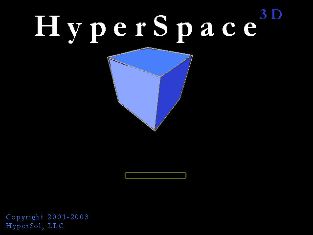

# HyperSol HyperSpace 3D

HyperSpace 3D is an open-source desktop web browser whose interface lives in three
dimensions. Ordinary websites float as panels in a 3D room, page sections
lift into layered depth, and a companion markup language, HoloML, lets
anyone publish a fully 3D website as easily as writing HTML.

Windows, macOS, and Linux. Apache 2.0. No telemetry.

**Status: milestones 1 to 8 done.** A browser in a 3D room that remembers and protects:
tabs as cards on an arc, a top bar with address, search, and a bookmark
star, bookmarks and history in a Library panel, a Settings panel, a
start panel with your data, error cards, a right-click menu, ad and
tracker blocking with a shield, encrypted DNS, and a layers view that
breaks pages apart into depth, in two themes: Nebula, a synthwave
night, and Daylight, a pastel 1990s day. See [Progress](#progress), TODO.md, and
[Project documents](#project-documents).

## The story

In December 2000, two computer engineering students who had met at
Florida Atlantic University, Sunny Rajpal and Mauricio Sadicoff, started
a small Florida software company. In early 2001 it became HyperSol, with
a plain mission: build high-quality software that makes people's
time on a computer more productive and more fun.

Their first product was a web browser. HyperSol WebSurfer was born, as
the original site put it, "when we needed some features that no other
browser would allow", starting with control over the pop-up windows that
plagued the web of 2001. Since they were writing a browser anyway, they
kept going. WebSurfer 1.0.0 shipped on March 5, 2001, free, for Windows
95, 98, 2000, and ME. By March 13 it was at version 1.0.6 and updating
itself with a press of Ctrl+U.

Some of what made it different still reads as ahead of its time:

- **Themes** that changed the whole browsing environment, not just the
  colours: new images, new buttons, and matching sounds across the
  application. It shipped with three: Surfer, Space, and Winter.
- **Automatic page refresh** for stock quotes every minute or headlines
  every five seconds.
- **A full HTML editor** built into the browser, with colour-coded source
  and one-click preview.

The site's own pitch was simple: "It's new, it's cool, and it's FREE!"
The company's second product, CheckIfSiteIsStillUp, was named Download
of the Day on TechTV's The Screen Savers in July 2001.

Behind the shipped features sat a bigger idea: a browser where the web
itself is not flat. Sites rendered in three dimensions. A browser you
look into, not at. Between 2001 and 2003 that idea became the concept
for HyperSol's next step after WebSurfer: HyperSpace 3D. An early
concept screen from that work survives, a blue cube tilted toward the
viewer over a loading bar, and is shown below as it was. It was a
concept of its time; there is no claim here that it shipped as a
product.



That was 2001. The hardware, the graphics APIs, and the open web
platform were not ready. Twenty-five years later they are.

## The salute

HyperSol HyperSpace 3D marks the 25th anniversary of HyperSol's
formation by finally building that idea, in the open, for everyone. It keeps the
spirit of the original: free, themed, a little bit cool, and made by
people who wanted a browser that did something no other browser would.

The name comes from that early concept; the spirit comes from
WebSurfer. The mission is the same. The third dimension, this time, is
real. (Until 2026-09-26 this project was called HyperSol WebSurfer 3D.)

HyperSol, the company, no longer exists. HyperSpace 3D is a personal
project that honours it, not a commercial product.

An archived copy of the 2001 site is available through the
[Wayback Machine](https://web.archive.org/web/20010922111629/http://www.hypersol.com/).

## What it will do

First useful result (see BRIEF.md):

- Open any normal website in a 3D browser interface, with tabs as
  floating cards, address bar, bookmarks, and history.
- Page sections lifted into layered depth.
- At least two themes, Nebula (dark) and Daylight (light).
- Privacy on by default: ad and tracker blocking, encrypted DNS, zero
  telemetry.
- Mouse, keyboard, and touch.

Later: HoloML page mode with a car showroom demo, images and 3D models
lifted out of ordinary pages, free camera movement, mobile, VR, and more.

## Progress

Twelve milestones are done: a live page on a tilted panel in the 3D room,
tabs as cards, bookmarks and history, ad and tracker blocking with
encrypted DNS, a layers view that lifts a page's parts to different
depths, two themes in a 1980s and 1990s look, an instrument panel, the
everyday tools (zoom, find, downloads, printing, private tabs), a
password manager with site permissions, and tab tools with an economy
mode and sleeping tabs. Milestone 11 added address bar completion, a
wider page with view settings, reorganized Settings, and shortcut
remapping. Milestone 12 made it ready to share as the 0.9.0 developer
preview, built from source, with automatic tests on Windows and Linux.
Milestone 13 wrote HoloML 0.1 down in its own repository, and milestone
14 (built, waiting for acceptance) shows HoloML pages in the browser.
See [docs/progress.md](docs/progress.md) for each milestone with
screenshots, and [TODO.md](TODO.md) for the roadmap.

## HoloML

HoloML is the 3D markup language developed alongside the browser, in its
own repository so it stays independent and reusable:
[github.com/srajpal/holoml](https://github.com/srajpal/holoml). Version
0.1 is written down there (SPEC.md), with a parser, a checker, and
sample pages; HoloML files use the extension `.holoml`. This browser
shows HoloML pages (milestone 14): open a `.holoml` address, or a file
with Ctrl+O, and walk or orbit around the scene.

## Project documents

| File | What it is |
|---|---|
| [BRIEF.md](BRIEF.md) | User, problem, full idea, first useful result, features for later |
| [ARCHITECTURE.md](ARCHITECTURE.md) | Technical decisions, parts and files, screens and style, open questions |
| [TODO.md](TODO.md) | Milestone roadmap and the current milestone's tasks and checks |
| [AGENTS.md](AGENTS.md) | Rules for AI agents and contributors working in this repo |
| [PROMPTS.md](PROMPTS.md) | Every owner prompt that shaped the project, in order, lightly edited |
| [HANDOFF.md](HANDOFF.md) | Current state, decisions made, open questions, how to resume |
| [CHANGELOG.md](CHANGELOG.md) | What each release contains |
| [CONTRIBUTING.md](CONTRIBUTING.md) | Setting up, testing, and sending changes |
| [SECURITY.md](SECURITY.md) | Reporting a security problem privately |
| [THIRD-PARTY.md](THIRD-PARTY.md) | The licences of the parts from other projects |
| [docs/name-checks.md](docs/name-checks.md) | Trademark and file extension checks |

## Technology

In use now: Electron 44 (the current supported stable line), TypeScript,
Three.js, Lit, SQLite through Node's built-in node:sqlite, and Ghostery's
open-source ad-blocking engine with open filter lists; Vite and
electron-vite to build; Vitest and Playwright to test.
Planned, not yet installed: electron-builder for installers (milestone 16).
Reasons for each choice are in ARCHITECTURE.md.

Known limitations: Electron ships no DRM module, so video from Netflix
and similar services will not play. The 3D room needs WebGL 2; where
Chromium cannot start it (no graphics driver, some virtual machines),
pages still work without the room, and a notice says so.

## Building and running

A developer preview (0.9.0): no installers yet, so build and run it from
source. Checked on Windows 11 here, and on Windows and Linux (Ubuntu) by
GitHub Actions for every push; macOS is untested.
[CONTRIBUTING.md](CONTRIBUTING.md) has the full setup, including Linux.

You need Node 22.13 or newer and pnpm 12.4.1. The pnpm version is pinned
in package.json (`packageManager`), so pnpm, or `corepack enable`, uses
that exact version. Install with the lockfile as it is:

```
pnpm install --frozen-lockfile
pnpm dev
```

The first run downloads the Electron binary (about 100 MB, from
Electron's GitHub releases) and checks it against the checksums shipped
in the electron package. The end-to-end tests also need `openssl` on
PATH, which Git for Windows provides.

`pnpm dev` opens the app on a start tab. Type an address or a search
in the top bar; Ctrl+T opens a tab, Ctrl+W closes one, Ctrl+Tab moves
between them, and the cards on the left switch tabs. Ctrl+D bookmarks a
page, Ctrl+Shift+O opens the Library, Ctrl+, opens Settings, and
Ctrl+Shift+L (or the layers button) switches the layers view, and
Ctrl+Shift+I the instrument panel. Ctrl+plus and minus zoom, Ctrl+F
finds, Ctrl+J shows downloads, Ctrl+P prints, and Ctrl+Shift+N opens a
private tab. A HoloML page (a `.holoml` address) shows as a 3D scene
across the window; Ctrl+O, or dropping a `.holoml` file on the window,
opens one from the computer. What
the browser stores and sends is listed in [docs/privacy.md](docs/privacy.md). Development runs use a
throwaway profile in the `userData/` folder, never your normal browser
data.

Tests: `pnpm test` (unit), `pnpm lint`, `pnpm typecheck`, and
`pnpm test:e2e` (builds the app and drives it for about six minutes;
needs openssl on PATH, which Git for Windows provides). Its windows stay
off screen and never take focus, so you can keep working; set
`HYPERSOL_TEST_SHOW=1` to watch instead. Current results are in
TODO.md.

## Contributing

Issues and pull requests are welcome: see [CONTRIBUTING.md](CONTRIBUTING.md)
for setup, tests, and how changes are reviewed. Rules for AI agents are
in [AGENTS.md](AGENTS.md).

## License

Copyright 2026 The HyperSpace 3D Authors (see [AUTHORS](AUTHORS)).
Licensed under the Apache License 2.0: see [LICENSE](LICENSE) and
[NOTICE](NOTICE). The parts from other projects keep their own licences:
see [THIRD-PARTY.md](THIRD-PARTY.md).
