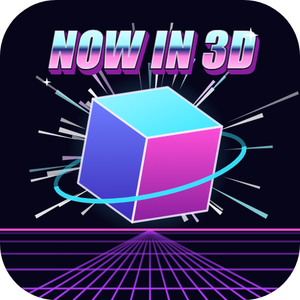
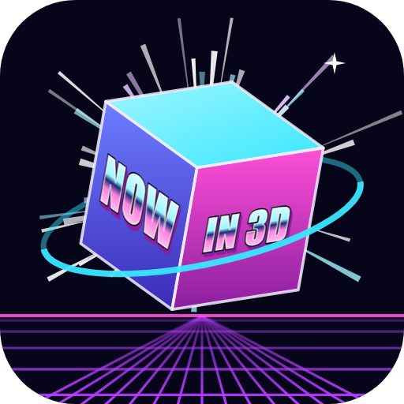
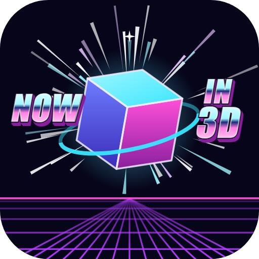
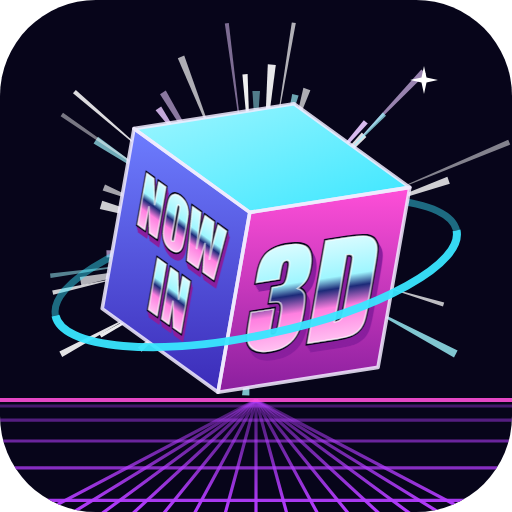

# App logo: first concepts

Starting point (owner, prompt 42): the early HyperSol concept screen
titled "HyperSpace 3D", a blue cube tilted toward the viewer
(docs/history/hyperspace-3d-concept-2001-2003.jpg). These are sketches
for discussion, not a chosen logo; none is used by the app yet. All use
the Nebula theme's colours and work as a square app icon.

Each concept is drawn as an SVG (the source) with a 512 px PNG copy
beside it, because some phone viewers do not show SVG images (owner,
prompt 44). The PNGs were made with headless Chrome from the SVGs;
redraw them if an SVG changes.

| Concept | Idea |
|---|---|
|  | **Cube in orbit.** The 2001 cube, tilted the same way, lit in Nebula's cyan, violet, and magenta, with an orbit ring for "hyperspace". Closest to the original. |
|  | **The cube is the browser.** Its front face is a web page (title bar dots, text lines) and its other faces glow: a page in three dimensions, which is what the app does. |
|  | **Cube over the horizon.** A wireframe cube floating over the neon grid and striped sun of the app's 3D room: the room itself in one mark, leaning into the 1980s look. |

## Concept 4: the mix (owner, prompt 45)

The owner asked for concept 1 and concept 3 combined: concept 3's grid
lines, no sun but "a little hyperspace effect" instead, and "Now in 3D"
in a cheesy 1990s font above or on the sides of the cube. All three keep
concept 1's cube and orbit ring over concept 3's neon grid, with star
streaks bursting out from behind the cube. The words are chrome block
letters with a magenta extrusion, in the Impact font.

| Version | Where the words go |
|---|---|
|  | **4a, above.** "NOW IN 3D" in one line over the cube. |
|  | **4b, on the cube.** "NOW" on its left face, "IN 3D" on its right face, following the faces' angles. |
|  | **4c, beside it.** "NOW" to the left of the cube, "IN" over "3D" to the right. |

**Chosen direction (owner, prompt 46): 4d**, which is 4b with "NOW IN"
on the left face and a bigger "3D" on the right face. It becomes the
real logo and icons in the first release milestone (12).

The words are too small to read at app icon sizes (16 to 48 px), so the
icon would be the same picture without them, and the version with words
would be the logo for the README, the About box, and the installer.
Before real use the lettering is turned into outlines, so it does not
depend on the Impact font being installed.

Other directions worth a sketch:
- The cube built from three stacked tab cards (the tab rail) at
  different depths.
- A monogram "H" drawn in perspective, its crossbar receding.
- The original blue cube exactly as in 2001, with only a cleaned-up
  outline, for a pure heritage mark.

Before a logo is final: it needs to read at 16 px (favicon, taskbar),
work on light and dark backgrounds (Daylight and Nebula), and be drawn
as proper vector artwork for the installers' icons (the first release
milestone).
