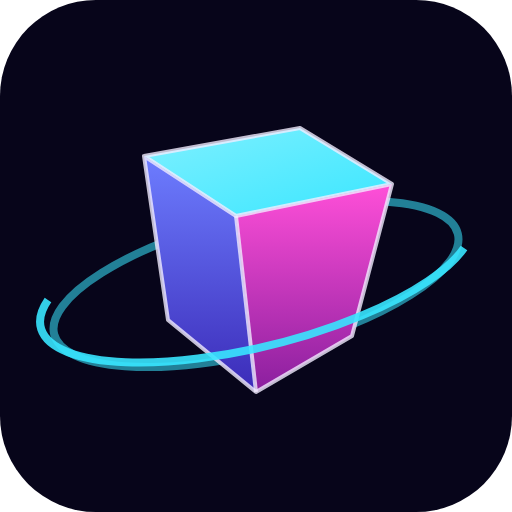
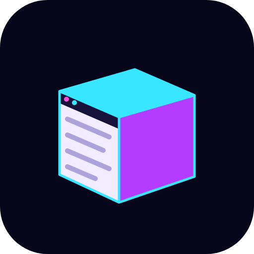
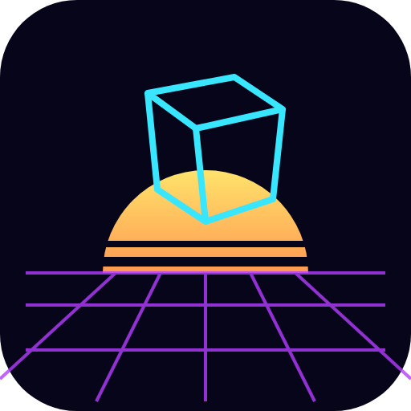

# App logo: first concepts

Starting point (owner, prompt 42): the early HyperSol concept screen
titled "HyperSpace 3D", a blue cube tilted toward the viewer
(docs/history/hyperspace-3d-concept-2001-2003.jpg). These are sketches
for discussion, not a chosen logo; none is used by the app yet. All use
the Nebula theme's colours and work as a square app icon.

Each concept is drawn as an SVG (the source) with a 512 px PNG copy
beside it, because some phone viewers do not show SVG images (owner,
prompt 44). The PNGs were made with headless Chrome from the SVGs;
redraw them if an SVG changes.

| Concept | Idea |
|---|---|
|  | **Cube in orbit.** The 2001 cube, tilted the same way, lit in Nebula's cyan, violet, and magenta, with an orbit ring for "hyperspace". Closest to the original. |
|  | **The cube is the browser.** Its front face is a web page (title bar dots, text lines) and its other faces glow: a page in three dimensions, which is what the app does. |
|  | **Cube over the horizon.** A wireframe cube floating over the neon grid and striped sun of the app's 3D room: the room itself in one mark, leaning into the 1980s look. |

Other directions worth a sketch:
- The cube built from three stacked tab cards (the tab rail) at
  different depths.
- A monogram "H" drawn in perspective, its crossbar receding.
- The original blue cube exactly as in 2001, with only a cleaned-up
  outline, for a pure heritage mark.

Before a logo is final: it needs to read at 16 px (favicon, taskbar),
work on light and dark backgrounds (Daylight and Nebula), and be drawn
as proper vector artwork for the installers' icons (the first release
milestone).
