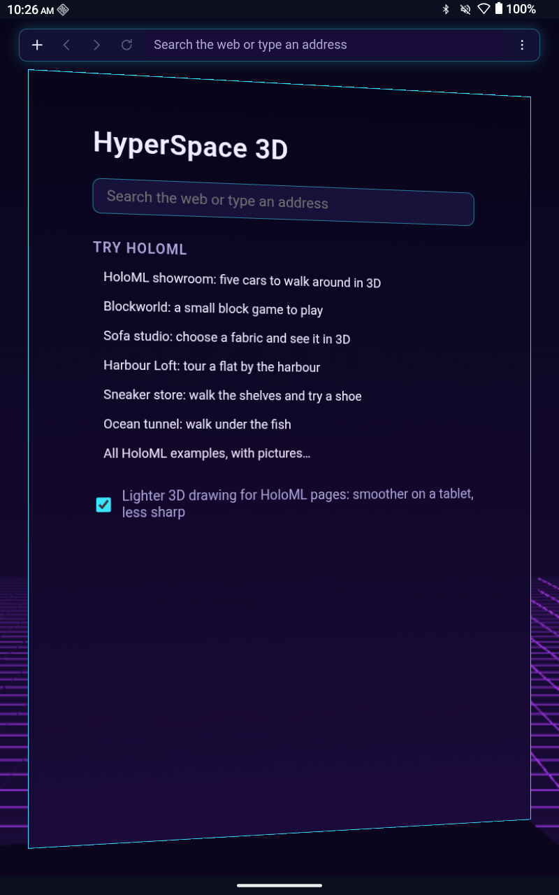
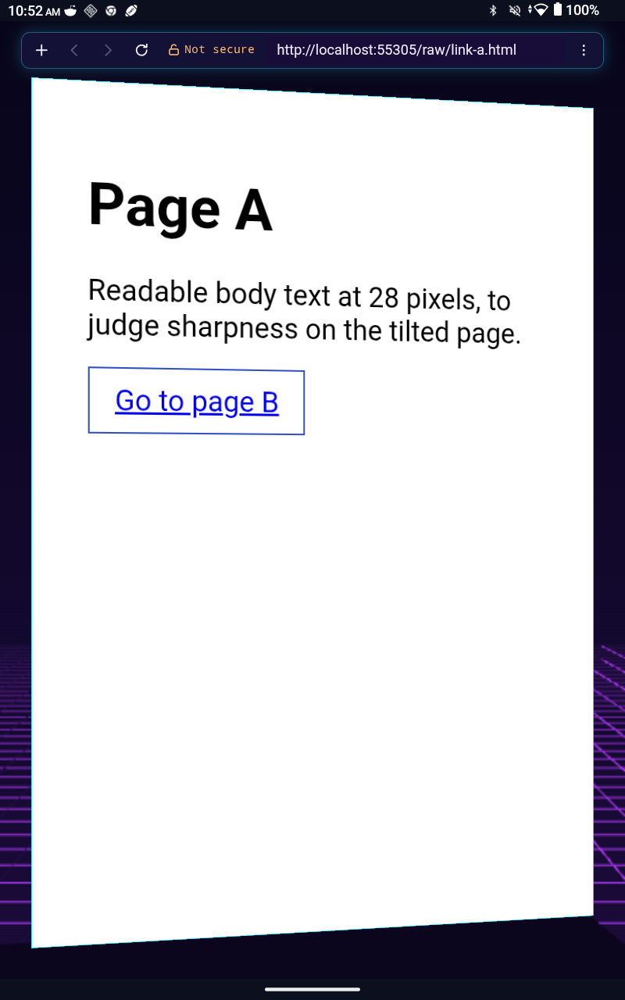
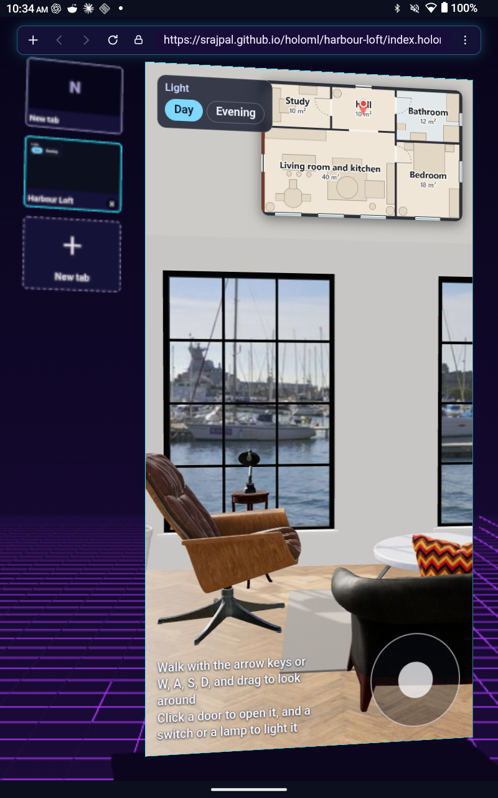
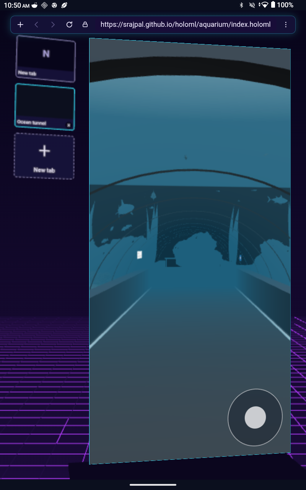
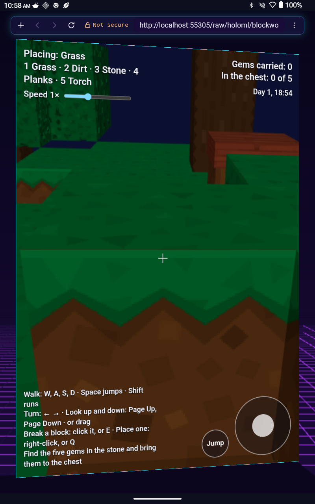
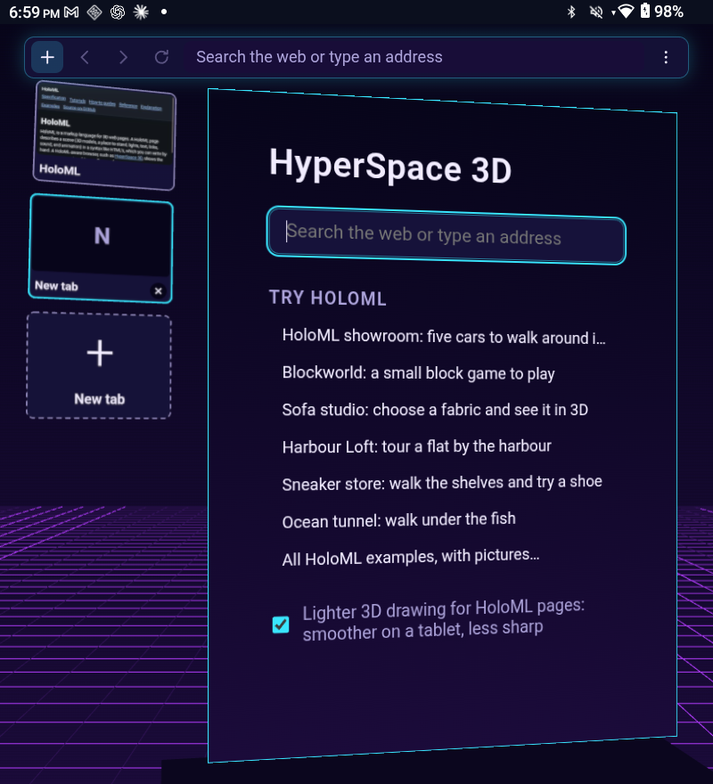
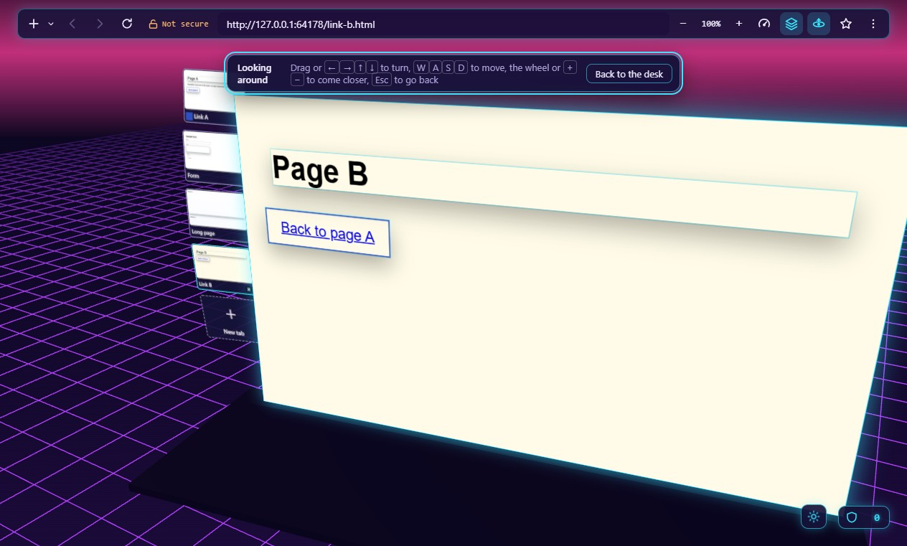
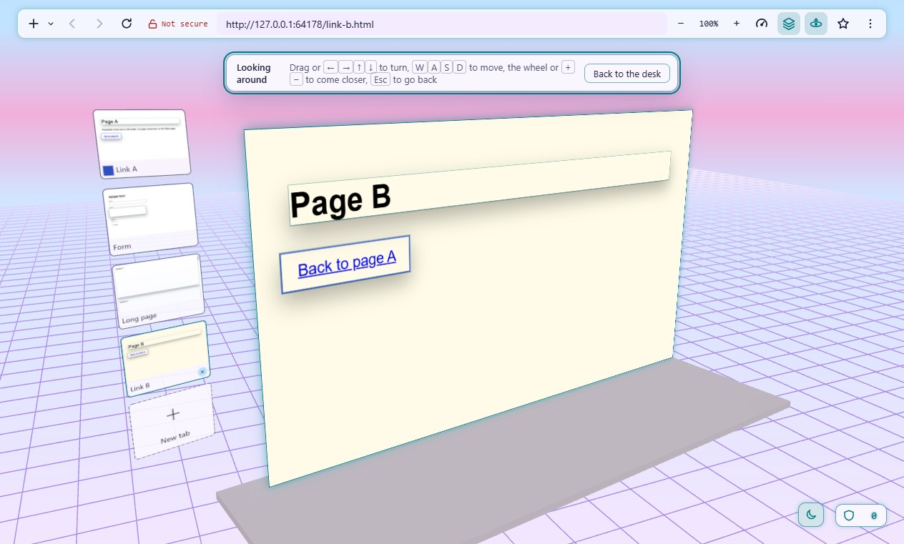
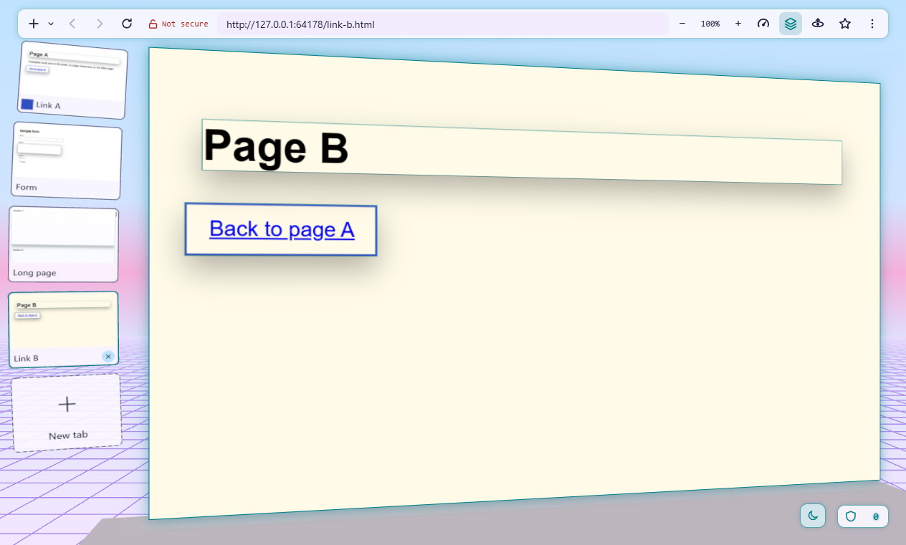

# HyperSol HyperSpace 3D: progress

What each finished milestone added, with screenshots of the main screens.
Moved here from the README on 2026-09-26 (owner, prompt 47).

Screenshots from each finished milestone. Only the newest sets are
kept in [docs/screenshots](screenshots) (milestone 27's, the newest of
the desktop, and milestone 24's, from the tablet); the older ones are
shown from the repository as it was on 2026-10-07 (commit
[64de0da](https://github.com/srajpal/hypersol-hyperspace-3d/tree/64de0da067ade4d27a8b28e9e76d4d208aa9ebad/docs/screenshots),
for milestone 22 commit
[fdc318f](https://github.com/srajpal/hypersol-hyperspace-3d/tree/fdc318f74d0baab1b7d362fc3aa1f791e7cdef16/docs/screenshots/m22),
for milestone 25 commit
[8fc1484](https://github.com/srajpal/hypersol-hyperspace-3d/tree/8fc14842d7bab690822d4a83244537051cc13734/docs/screenshots/m25),
and for milestone 26 commit
[9b36abf](https://github.com/srajpal/hypersol-hyperspace-3d/tree/9b36abf685b520b3624e7424603ce5906c5aeca6/docs/screenshots/m26)),
so a copy of the repository does not carry every set (the review of
2026-09-30, H6; owner, prompt 160). The roadmap and the current
milestone's tasks and checks are in [TODO.md](../TODO.md).

**Milestone 1: a live page in the 3D room.** A real website on a tilted
panel, clicks and typing working.

**Milestone 2: browsing basics.** Tabs as cards on an arc, the top bar,
the start panel, and error cards.

**Milestone 3: memory and settings.** Bookmarks and history, the Library
and Settings panels, and a start panel with your data.

**Milestone 4: private by default.** Ad and tracker blocking with a
shield that counts and lists what was blocked, element hiding, a
"blocked" card with "Open anyway", pausing the shield per site, and
encrypted DNS through Quad9. Details in [docs/privacy.md](privacy.md).

**Milestone 5: depth layering.** A layers view breaks a page's main
sections and images apart into separate depths, following the room's
parallax; the page stays fully usable. It is on by default, with a
global switch in Settings and a choice remembered per site. The page
also reports where its images are, groundwork for lifting them into 3D
later.

**Milestone 6: themes and look.** Two finished themes leaning into the
1980s and 1990s, switched with the button at the bottom right or in
Settings (which can also follow the system's light or dark setting). The
room, cards, panels, and window all follow the theme. Settings > Page
tilt trades the lean for sharper text.

**Milestone 7: instrument panel.** Floating panels with live readouts,
like a light DevTools in the room: dials and meters for the page in
front (load time, requests, data, blocked, CPU, memory, connection and
certificate) and for the browser (tabs, memory, frame rate, filter
lists, encrypted DNS, clock), plus the page's console and network list.
Off by default: Ctrl+Shift+I, the gauge button in the top bar, or
Settings, where each part can be switched on its own. The console and
network list maximize for reading.

**Milestone 8: everyday browser features.** Zoom buttons in the top bar
(remembered per site), find in page, a Downloads panel (files go to your
Downloads folder), printing, and private tabs that keep nothing.

**Milestone 9: passwords and site permissions** (accepted 2026-09-26). After you sign in, the browser offers to save
the password, encrypted with your system's keychain; later, clicking the
sign-in field lists the saved account, and picking it fills the form.
The Library has a Passwords tab. Sites ask before using the camera,
microphone, or location (Allow, Allow this time, Block), with a site
panel behind the lock in the top bar and a LIVE mark on the tab. Also: a
notice when a download finishes or fails, New private tab under "+",
and pages print flat.

**Milestone 10: tabs and economy** (accepted 2026-09-26). Reopen a closed tab (Ctrl+Shift+T) with its back history,
search your tabs (Ctrl+Shift+A), and mute a tab from the speaker on its
card. Settings > Tabs sets the card size and whether tabs show as
cards, cards that hide, or a list in the top bar. Economy mode (on by
itself when running on battery) draws the room more simply at 30 frames
a second, and unused tabs go to sleep to free memory. History searches
now run on their own thread with an index, fast even with 100,000
visits.

**Milestone 11: your feedback** (accepted 2026-09-26). The address bar completes sites you have visited as you
type and lists the best matches. The leaning page now reaches both
sides of the window, and Settings > Appearance and view sets how far
and which way it leans, how much the room moves, and the space around
it, or "Flat and still" in one step. Settings has sections and a
search; every shortcut is listed and can be changed. Menus close when
you click elsewhere, "Cards that hide" is gone, and the Library's
search empties between tabs.

**Milestone 12: developer preview 0.9.0** (accepted and released
2026-09-26). The browser is ready to share as source:
project and legal files, version 0.9.0, and automatic builds and tests
on Windows and Linux. Where a computer cannot draw the 3D room, the
browser now still works and says why.

**Milestone 13: HoloML 0.1** (accepted 2026-09-27). The language is
written down in the holoml repository, with a parser, a checker, and
sample pages; no new browser screens.

**Milestone 14: HoloML pages in the browser** (accepted 2026-09-27). A `.holoml` page shows its 3D scene across the window,
flat and still, with models, labels, links, lights, and animation; a
page with a mistake says where it is.

**Milestone 15: HoloML hardening** (accepted 2026-09-27). A heavy or hostile scene cannot exhaust memory: what
crosses a limit is left out, marked, and explained. A scene can be used
from the keyboard, with a screen reader, as plain text, or without
motion, and the instrument panel shows how it is built.

**Milestone 16: car showroom demo** (accepted 2026-09-27). HoloML's own showroom: five cars in a round hall, one on a
turntable, each with a page to walk around it in three colours. It is
published from the holoml repository, and the start panel links to it.

**Milestone 17: Blockworld and the HoloML examples** (accepted
2026-09-27). Blockworld, a small block game written in the
first part of HoloML 0.2: a script, sound, text on the screen, walls and
gravity, and a day that turns to night. The browser gains a HoloML
examples section with a picture of each example.

**Milestone 18: sofa studio** (accepted 2026-09-28).
First, a page says how fast the viewer walks and turns, and sliders go
on the screen (Blockworld's Speed slider). Then the sofa studio,
HoloML's first shop page: shadows, the fabrics' own pictures, choices
that change the sofa in place, and light from a photo studio's
panorama; the price follows the choices, and the evening lamp casts its
own shadows.

**Milestone 19: Harbour Loft** (accepted 2026-09-29).
HoloML 0.2's third part: text of more than one line on a board in the
scene, doors and lamps that work with a click (and from the keyboard),
places to go to, a fade between a site's pages, a sky, and a floor plan.
Harbour Loft shows them: a flat by a harbour to tour, with a panel in
each room, lamps to switch on in the evening, and a roof terrace.

**Milestone 20: sneaker store** (accepted 2026-09-29).
HoloML 0.2's fourth part: groups of models that load only while the
viewer is near, and are let go (their memory released) when the viewer
walks away, with a lighter stand-in in each model's place until then.
The sneaker store shows it: one shoe in ten colourways on the walls of a
hall, each bay's six shoes loaded as you come near, and a shoe's own page
to turn it over, choose its colour and size, and add it to a cart.

**Milestone 21: ocean tunnel** (accepted 2026-09-29).
HoloML 0.2's fifth and last part, which completes it: water that things
are seen through, fading into its colour with distance, with the light
from its waves moving over what is in it; sounds that come from a place;
and a model's animation speed for scripts. The ocean tunnel shows them:
an aquarium to walk through, where 30 fish of nine kinds swim over and
around a glass tunnel among rocks, plants, and rising bubbles. Feed
them, and the nearest come to eat; click a fish to read about it.

**Milestone 22: HoloML's documentation** (built 2026-09-29).
HoloML documented to recognised standards: its specification in the
form of W3C specifications, with its grammar in ABNF and RELAX NG and
its scene API in Web IDL, and guides organised as tutorials, how-to
guides, reference, and explanation, published as a site with GitHub
Pages. The HoloML examples section links to the published
specification. Found while taking these pictures: the layers view drew
a very tall page blank below its bar; a section too large to lift now
stays flat and draws.

**Milestone 23: HoloML for VS Code** (accepted 2026-10-05).
An extension for VS Code and the editors built on it, in the holoml
repository: syntax colours, mistakes underlined as you type with the
checker's own words, suggestions of only what is allowed where the
cursor is, help on hover from the specification, snippets, end tags
written for you, the outline, colour swatches, and going to a
`#name`. Installed by hand from a file; no preview and no network. It
changes nothing in the browser, whose screens stay as milestone 22
left them; pictures of the extension at work are still to be made.

**Milestone 24: HyperSpace 3D for Android** (accepted 2026-10-07).
The browser on an Android tablet: the desktop's own 3D room, top bar,
and start panel, with each tab's live page on the tilted panel, where
taps land where they appear. Tabs open, close with a swipe on their
card, and reopen, and the tablet's tilt moves the room. HoloML pages
walk by touch, with a pad on the screen, a jump button, and a long
press for a right-click; a lighter drawing keeps the ocean tunnel at
33 frames a second on the owner's tablet. Pictures from that tablet.

**Milestone 25: HoloML 0.3** (accepted 2026-10-08).
Names for models and groups that screen readers say and the text view
and the Scene inspector show; text in its own language and direction,
so Arabic and Hebrew run right to left in the scene and are read in
their own voices; a lighter model for far away, which the ocean
tunnel's fish now have; compressed models, which make the sneaker store
a third of the download it was; and a page's description in its tab's
tooltip, the text view, and the Scene inspector. A new HoloML example,
Words in a room, shows the languages.

**Milestone 26: privacy and data tools** (accepted 2026-10-08). Pages load over HTTPS only: a site that does not offer it
gets a card before anything goes over plain HTTP, and continuing
allows it until the browser closes (or for good, from the site panel
or Settings). The Library's new Sites tab shows each site's cookies and
clears one site's data without touching the others; and bookmarks come
in from another browser's bookmark file, after a preview, and go out to
one.

**Milestone 27: looking around the room** (accepted 2026-10-09). Leave the desk by dragging
on the room, with the arrows and W, A, S, D, or with the top bar's new
button (Ctrl+Shift+K), and move around the desk within the room; a
notice says how, and Escape or "Back to the desk" brings the camera
back, with the page exactly where it was. While away the page takes no
clicks or keys.

